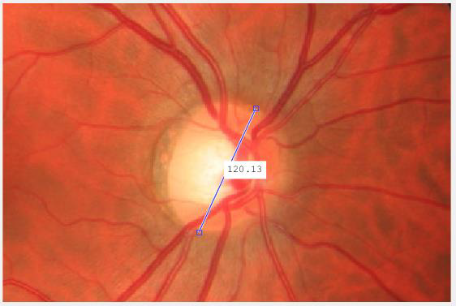
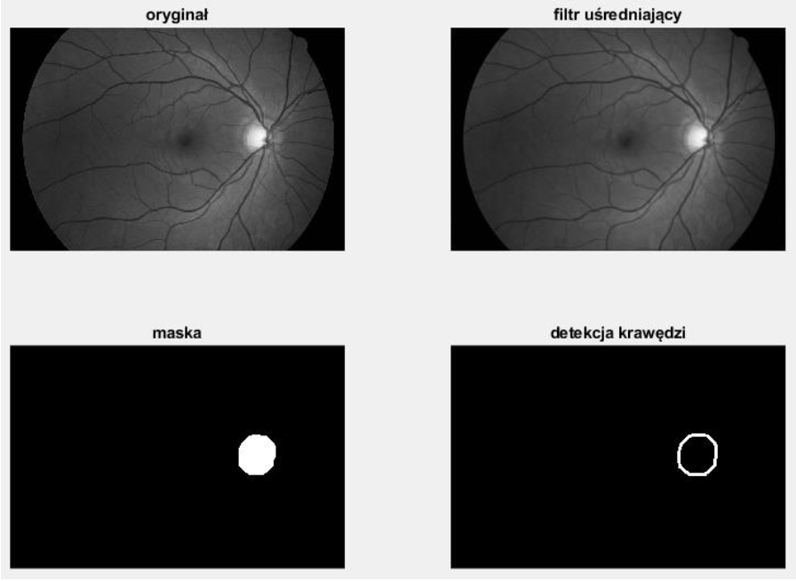
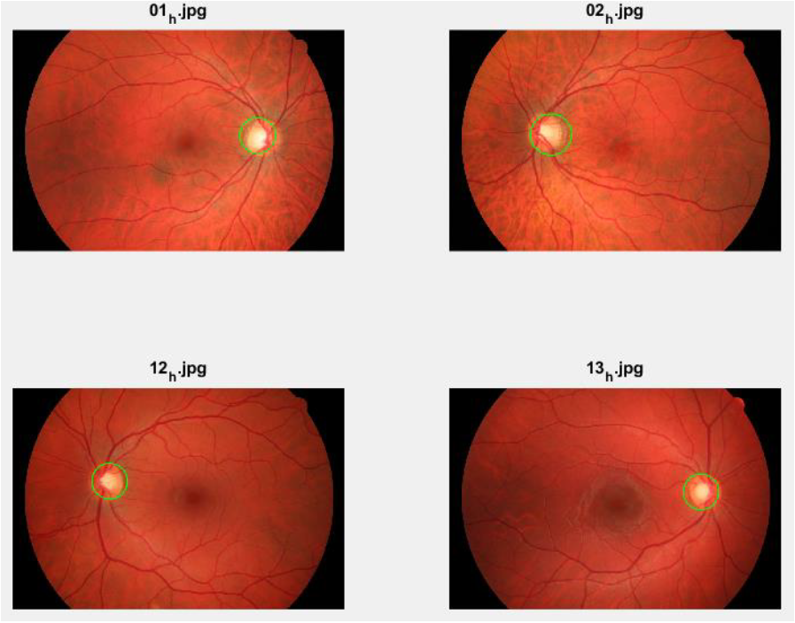

# Optic nerve disc detection
Optic nerve disc detector based on [circle Hough transform](https://en.wikipedia.org/wiki/Circle_Hough_Transform), self-estimating best result function and Canny edge detector.

## Table of content
* [Main goal](#main-goal)
* [Detection steps](#detection-steps)
* [Detection results](#detection-results)
* [Author](#author)
* [License](#license)

## Main goal
The main goal was to detect the optic disc in sample retinograms. The optic nerve disc can be damaged by diseases such as glaucoma or diabetic neuropathy. The Hough transform-based region of interest detection system identifies the optic nerve disc for subsequent feature identification and extraction using pattern recognition methods. 

## Detection steps
1. Selecting the best RGB component based on the histogram.
2. Image adjustment (filtering and thresholding) and edge detection using the Canny method.
3. Circle detection using the Hough transform.
4. Selection of the best district (based fully automatic method).

> NOTE: 
In order to speed up the operation and minimize false detections, the diameter of the optic disc was measured using the `imdistline` function. The resulting diameter value was divided by 2, and this value was used to narrow down the maximum radius of the search for circles by the Hough transform.

### After image adjustment

### Hough black-box input and output

In order to calculate the Hough transform, the `houghTransform` function was created taking parameters, respectively:

* `img` - binary image with edge labeling,
* `rMin` - the minimum radius of the circles sought,
* `rMax` - the maximum radius of the searched circles,
* `rNr` - number of radius intervals,
* `pNr` - number of peaks in the accumulator,
* `thr` - threshold value for peaks in the accumulator.

The function returns two matrices:

* `circCent` - matrix (`rNr`*`pNr`) x 2 containing the coordinates of the centers of the circles,
* `circRad` - matrix (`rNr`*`pNr`) x 1 containing the lengths of the radii of the circles.

### Self-estimating best result function

The result of the Hough transform contains `N` circles (N as the number specified in the parameters of the `houghTransform` function). In order to determine the best circle, the `findOptimalCircle` function was created. This function finds the most optimal circle based on the largest edge pixel coverage. If a circle is found whose pixels cover the edges of the optic disc to the greatest extent, the function returns its XY coordinates.

The function takes the following parameters:

* `c` - matrix (`rNr`*`pNr`) x 2 containing the coordinates of the centers of the circles,
* `r` - matrix (`rNr`*`pNr`) x 1 containing the lengths of the radii of the circles,
* `img` - a binary image representing the edges of the optic disc.

And returns:

* `x` - vector of coordinates of the circle of the `0x` axis,
* `y` - vector of coordinates of the circle of the `0y` axis.

## Detection results

## Author
Created by Miłosz Gilga. If you have any questions about the application send message: [personal@miloszgilga.pl](mailto:personal@miloszgilga.pl).

## License
This program is on GNU-GPL 3.0 license.
